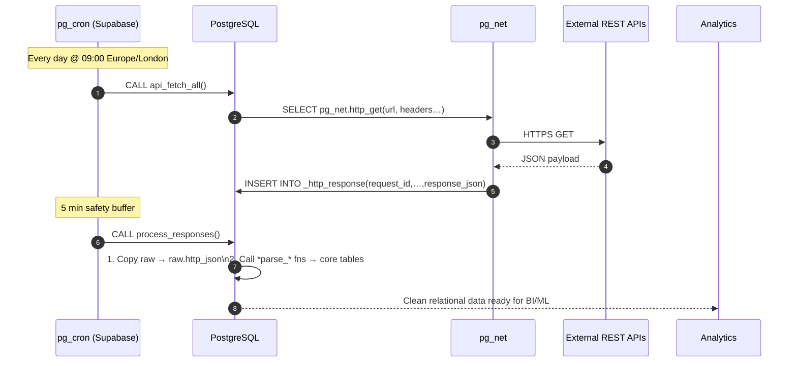

```mermaid
sequenceDiagram
    autonumber
    participant CRON as pg_cron (Supabase)
    participant DB as PostgreSQL
    participant NET as pg_net
    participant API as External REST APIs

    Note over CRON: Every day @ 09:00 Europe/London
    CRON->>DB: CALL api_fetch_all()
    DB->>NET: SELECT pg_net.http_get(url, headers…)
    NET->>API: HTTPS GET
    API-->>NET: JSON payload
    NET->>DB: INSERT INTO _http_response(request_id,…,response_json)

    Note over CRON: 5 min safety buffer
    CRON->>DB: CALL process_responses()
    DB->>DB: 1. Copy raw → raw.http_json\n2. Call *parse_* fns → core tables
    DB-->>Analytics: Clean relational data ready for BI/ML
```